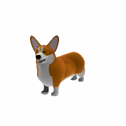
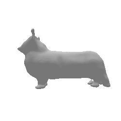
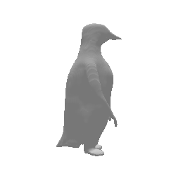
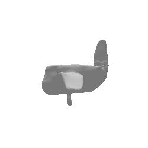

# Image to 3D Model Converter

This project converts a single image of an object into a 3D model (.obj or .stl format). It uses AI/ML techniques to generate a 3D mesh from a 2D image.

# API Support
I have also added api support to the app so it can be hosted directly. I tried to host the model but couldn't find a free GPU instance anywhere :(

## Features

- Image preprocessing with background removal
- 3D model generation from single image
- 3D model visualization
- Export to .obj/.stl format

## Requirements

- Python 3.8+
- See requirements.txt for Python dependencies

## Examples

### Example 1
**Input**  


**Output**  


### Example 2
**Input**  


**Output**  


### Example 3
**Input**  


**Output**  


## Installation

```bash
# Clone the repository
git clone https://github.com/varun-101/imageTo3D.git

# Create a virtual environment
python -m venv venv
source venv/bin/activate

# Install dependencies
pip install -r requirements.txt
```

## Usage

1. Place your input image in the `input` folder
2. Run the main script:
```bash
python main.py --input input/your_image.jpg --output output/model.obj
```

## Project Structure

```
.
├── main.py              # Main script
├── utils.py             # Utility functions
├── requirements.txt     # Python dependencies
├── input/              # Input images
└── output/             # Generated 3D models
```

## Implementation Details

1. **Image Preprocessing**
   - Load image using OpenCV
   - Remove background using rembg
   - Normalize and prepare for 3D generation

2. **3D Generation**
   - Generate 3D mesh from preprocessed image
   - Post-process the mesh for better quality

3. **Visualization & Export**
   - Visualize using trimesh/pyrender
   - Export to standard 3D formats 